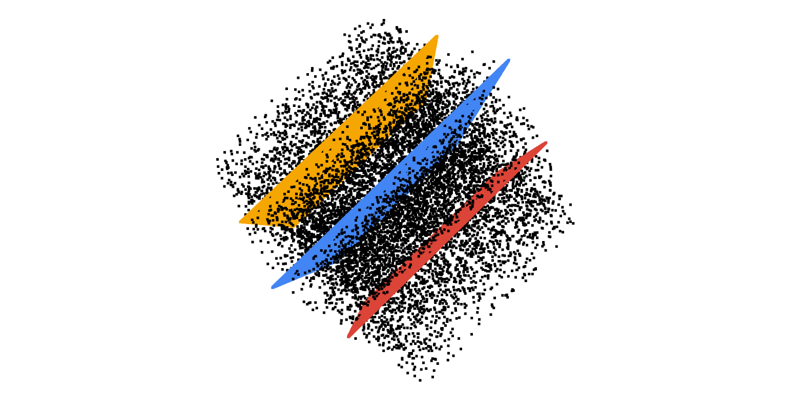
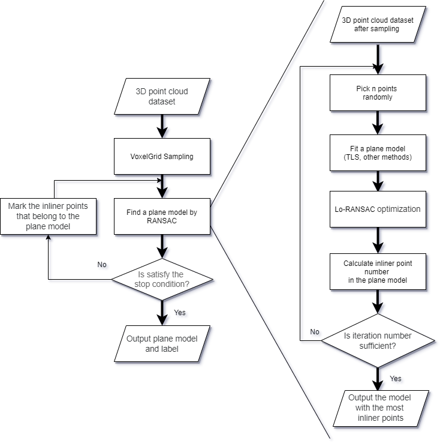
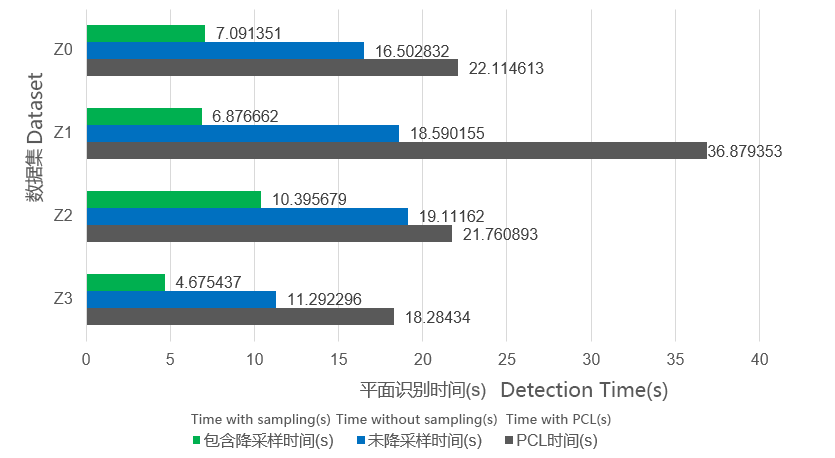
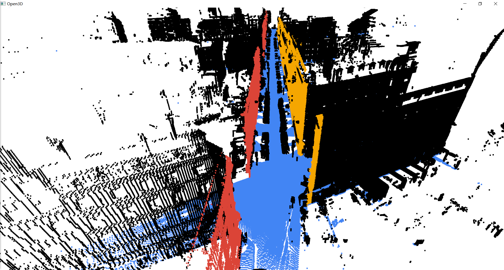
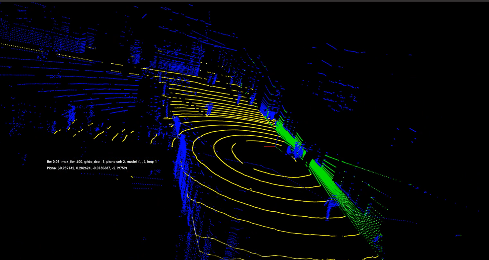
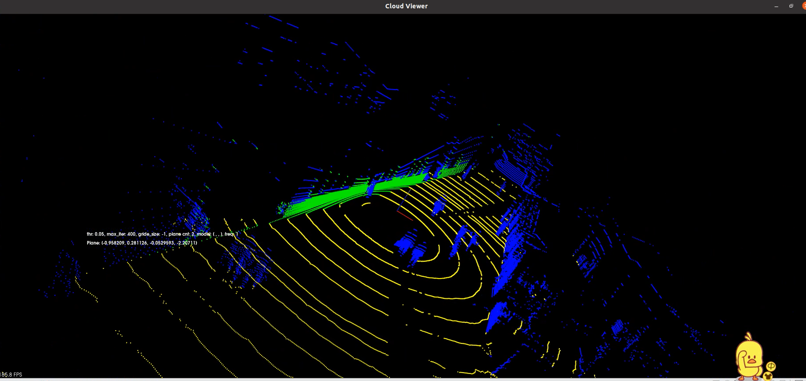

# Plane detection algorithm implementation from 3D point cloud   

[[EN](README.md)] | [[简体中文](README_CN.md)]

### Introduction

Team Name: No Plane Cannot Be Detected

Team Members:  [Yechun Ruan](https://github.com/ryyyc), [Wanli Zhong](https://github.com/zoom1111), [Changzhen Zhang](https://github.com/changzhenzhang)

Mentor: [Shiqi Yu](https://github.com/ShiqiYu)


This project relies on [OpenCV](https://github.com/opencv/opencv) using C++ 11 as the programming language, a multi-plane detection algorithm of point cloud is realized. At the same time, a relatively effective algorithm optimization is proposed. It has a good performance in the accuracy and speed of multi-plane detection.



<br><br>

### Technical Background

Our team plans to implement the algorithm of **plane detection from 3D point cloud**, and deal with certain noise and isolated points.

Point cloud data refers to a set of vectors in a three-dimensional coordinate system, recorded in the form of points. The information of each point includes three-dimensional coordinates, and some may contain color information or reflection intensity information. For the algorithm of recognizing multiple planes in point cloud space, we only need to use the three-dimensional coordinate information of point cloud. We believe that a matrix [**cv::Mat**](https://docs.opencv.org/master/d3/d63/classcv_1_1Mat.html)  with N rows (total number of data points) and 3 columns (three-dimensional coordinates) is used in OpenCV. As a data structure for storing point cloud, it has great speed advantage in matrix operation, and point cloud data is continuously stored in memory. It is convenient to operate the pointer.

After many considerations, our team decided to mainly use RANSAC algorithm to realize multi plane detection in point cloud space. In order to solve the problem of high computation of RANSAC algorithm in a large number of point cloud data, we will sample the original data of point cloud, reduce the amount of data of points used to calculate distance, record the relationship between sampling points and original points, and preserve the spatial characteristics of point cloud as much as possible. In order to solve the problem that RANSAC algorithm can not detect multiple planes at the same time, we mark the identified planes and apply RANSAC algorithm many times to meet the requirements. When a plane is found, mark the inner point of the plane (the point whose distance to the plane is less than the given threshold). When finding the next plane, the calculation continues only in the unmarked points. When the cut-off condition is reached (the identification result reaches the specified number of planes or the number of inner points of the last plane result is less than the set value), the algorithm terminates. In addition, we also use a variety of algorithms to optimize RANSAC.	

##### RANSAC Algorithm

The basic idea of RANSAC is to select multiple plane models by randomly selecting three points from the point cloud, and then calculate the number of interior points of each plane within the threshold. Finally, the plane with the most points is the best plane in the current point cloud.

##### Voxel Filter Sampling

The basic principle of voxel filter sampling is: split the point cloud space into cuboids or cubes of equal size. For each cube, select the point closest to the center of gravity of all points in the cuboid to represent the points of the whole cuboid.

##### Lo-RANSAC

Lo-RANSAC has many schemes to optimize RANSAC. In the process of iterative plane detecting, if the current optimal plane model appears, Lo-RANSAC can be considered. One method is to randomly select some points from the interior points of the current optimal plane model to fit the plane model again, calculate the interior points, iterate for a certain number of times, and select the best result as the improvement result.

##### Pruning

Pruning is to finish some unnecessary calculations in time when calculating the interior points of the plane model, which belongs to the optimization of details.

##### Total Least Square

In the plane model fitting part of RANSAC, when the Ordinary Least Square method is used to fit the plane, some special planes may not be fitted, such as plane $x = 0$. The calculation method of Total Least Square (TLS) can solve this problem. In addition, there are other plane fitting methods, and we are also prepared to select the final method through testing.

##### Early Termination of Iteration

Using the theories of probability and statistics, we can calculate the conditions for early termination of iteration. The principle is as follows:

* In a point cloud space "PC", the number of points is $N$, the number of interior points of the largest plane "PlaneMax" is $M$, and three points are randomly selected. The probability that all three points belong to the plane "PlaneMax" is $(\frac{M}{N})^3$.
* Each time three points are taken from the point cloud space to construct a plane, the probability that not "PlaneMax" is obtained for the continuous construction of $K$ planes is $(1 - (\frac{M}{N}) ^ 3) ^ K$, and the probability that at least one plane of $K$ planes is "PlaneMax" is $1 - (1 - (\frac{M}{N}) ^ 3) ^ K$.
* If we want to find the maximum plane correctly when the probability is not less than $P$, we can solve the equation $1 - (1 - (\frac{M}{N}) ^ 3) ^ K>P$ and get the result $K > \frac{log(1-P)}{log (1 - (\frac{M}{N}) ^ 3)}$ . So we only need to make the number of iterations not less than $\frac{log(1-P)}{log (1 - (\frac{M}{N}) ^ 3)}$.

- It can also be noted that even if the size of $M$ is not known at the beginning, the number of interior points of the maximum plane found so far saved in the iteration process $A$ will not be greater than $M $, so the algorithm only needs to make the number of iterations no less than $\frac{log(1-P)}{log (1 - (\frac{A}{N}) ^ 3)}$.

##### Normal Vector Constraint

In the actual test, we found that sampling will make the point cloud density uniform, resulting in the change of the order of plane recognition. Although it does not affect in multi plane recognition, it is considered that in practical applications, such as vehicle identification pavement, UAV identification wall and so on, only specific plane recognition is required. We use the vector constraint method to identify only the plane with small angle between the normal vector and the vector, and then we can detect the plane in a specific direction.

<br><br>

### Scheme Design



<br><br>

### Software Environment

* OpenCV 4.5.1
* g++ 5.4
* Python 3.6 + Open3D Python version (optional，used for visualization)

Installation Tutorial: [OpenCV](https://docs.opencv.org/4.5.1/df/d65/tutorial_table_of_content_introduction.html), [Open3D](http://www.open3d.org/docs/latest/introduction.html)

<br><br>

### Directory Structure

```
.
├── data (Data input and output directory)
│   ├── Cassette_GT_.ply-sampling-0.2.ply
│   └── check.ply
│   └── check_label.txt
├── images (Document picture directory)
├── include (Header file directory)
│   ├── ransac.h
│   └── utils.h
├── source (Source file directory)
│   ├── main.cpp
│   ├── ransac.cpp
│   └── utils.cpp
└── viz  (Visual sample code directory)
    └── Pointcloud-Visualization-With-Open3D.py
```

<br><br>

### Dataset

Some datasets are from: [IQmulus & TerraMobilita Contest](http://data.ign.fr/benchmarks/UrbanAnalysis). Download links: [Zones 0-4](http://data.ign.fr/benchmarks/UrbanAnalysis/download/Z0-4.zip), [Cassette_idclass.zip](http://data.ign.fr/benchmarks/UrbanAnalysis/download/Cassette_idclass.zip).

Another part of the dataset is generated by standard plane equation with noise points.

<br><br>

### Instructions

The interface of 3D point cloud plane detection is:

   ```c++
   /**
    *
    * @param labels  The label that the point belongs to a certain plane, n × 1 matrix, n is equal to the size of the input point cloud (output)
    * @param planes  Holds the vector of plane equations, the equation is expressed as ax + by + cz + d = 0 (output)
    * @param points3d  Input point cloud data
    * @param thr  Threshold
    * @param max_iterations  Maximum number of iterations
    * @param desired_num_planes  Number of target planes
    * @param grid_size  Downsampling grid size, if less than or equal to 0, it means no downsampling
    * @param normal  Normal vector constraint, nullptr means no constraint is used, otherwise the detected plane normal vector satisfies the constraint
    */
   void get_planes(cv::Mat &labels, std::vector<cv::Vec4f> &planes, cv::InputArray &points3d,
                   float thr, int max_iterations, int desired_num_planes, float grid_size, cv::Vec3f *normal);
   ```

Explain in Detail:

1. **labels**: The parameter type is `cv::Mat`, n × 1 matrix, single channel, int type data, used to save the label of the point, 0 means not belonging to any plane, positive integer k means belonging to the number k plane
2. **planes**: The parameter type is `std::vector<cv::Vec4f>`, which is used to save the equations of the plane. [a, b, c, d] quaternion corresponds to ax + by + cz + d = 0
3. **points3d**: The parameter type is `cv::Mat`, n × 3 matrix, single channel, float type data, used to store point cloud data
4. **thr**: The parameter type is `float`, if the distance from the point to the plane is less than this value, the point is considered to belong to the inner point of the plane
5. **max_iterations**: The parameter type is `int`, the iteration will stop when the number of iterations reaches this value, and the plane equation with the most interior points will be output
6. **desired_num_planes**: The parameter type is `int`, this value represents the number of planes that you want to find from the point cloud
7. **grid_size**: The parameter type is `float`, the side length of the voxel filtering down-sampling grid, if it is less than or equal to 0, it means no down-sampling processing
8. **normal**: The parameter type is `cv::Vec3f*`, the normal vector of the plane in the three-dimensional space, nullptr means no constraint is used, otherwise the detected plane normal vector satisfies the constraint


<br><br>

### Run Demo

1. Clone
```shell
git clone https://gitee.com/openeuler2020/team-1902378398.git
```
2. Compiler
```shell
cd team-1902378398

cmake .

make
```
Note: The above are the compilation steps for Linux operating system. If it is windows operating system, please modify the ninth line of the [CMakeLists.txt](./CMakeLists.txt) file and set the OpenCV directory to the corresponding installation directory.

3. Run

* DEMO 1

```shell
./Point-Cloud-Plane-Detection 3 0.2 0.2 1000 ./data/check.ply 0 0 0
```

* DEMO 2
```shell
./Point-Cloud-Plane-Detection 3 0.5 0.22 1000 ./data/Cassette_GT_.ply-sampling-0.2.ply 0 0 0
```

The incoming parameters are the number of target planes, the threshold, the grid size, the maximum number of iterations, the path of the point cloud file, and the normal vector constraint (0, 0, 0 means not using the normal vector constraint).

<br><br>

### Point Cloud Visualization

Point cloud visualization can be achieved through Open3D (APP version, C++ version, Python version), PCL (C++ version, Python version), etc.

The Python version of the Open3D visualized point cloud sample code is in  [./viz/Pointcloud-Visualization-With-Open3D.py](./viz/Pointcloud-Visualization-With-Open3D.py)

- DEMO

```shell
python ./Pointcloud-Visualization-With-Open3D.py -cloud "../data/check.ply" -label "../data/check_label.txt"
```

<br><br>

### Test

##### Test based on OpenEuler

Test platform configuration:

- Architecture: Kunpeng 920Test
- Operating system: OpenEuler operating system release 2.0
- CPU: 8 cores 8 threads
- Memory Size: 8 GB

Test Results:

| Dataset  | Point Cloud Size | Output Plane                                         | inliers num | Time Cost (s) |
| -------- | ---------------- | ---------------------------------------------------- | ----------- | ------------- |
| Z0       | 13653854         | 0.004945x + 0.011472y + 0.999922z + -291.109375 = 0  | 4727446     | 19.232788     |
| Z1       | 12128400         | 0.020881x + 0.012112y + 0.999708z + 254.261597 = 0   | 3813037     | 16.864428     |
| Z2       | 13685800         | 0.005071x + -0.012349y + 0.999911z + 289.661438 = 0  | 4823840     | 31.713732     |
| Z3       | 9783553          | 0.004871x + 0.001634y + 0.999987z + -11.740292 = 0   | 3481107     | 12.401383     |
| Z4       | 16693019         | 0.002529x + -0.013667y + -0.999903z + 322.821136 = 0 | 6809349     | 32.885815     |
| Cassette | 12000000         | 0.998165x + 0.057841y + 0.017908z + 3130946045 = 0   | 3307173     | 12.424324     |

<br>

##### Ubuntu Based Test

See **[Test Report](./TEST_REPORT.pdf) (click to download the details of the test report)**, including the test of this program and PCL([Point Cloud Library](https://pointclouds.org/)) RANSAC test

The pictures in the test report can be found in [./images/rep_pic](./images/rep_pic).

<br>

Single plane recognition time comparison test results:



<br>

Some test results are as follows:

- Z0


- Z1



- Cassette_GT


Tests in real scenarios:






##### Test conclusion

Our team’s optimized RANSAC algorithm has the following advantages:

- After comparing with PCL and testing with randomly generated standard plane equations, the plane equations we got are almost identical, verifying the accuracy of the detection plane
- In the speed comparison with PCL, the overall speed is better
- Able to identify multiple planes at once
- You can freely choose whether to use sampling to preprocess the point cloud
- Can identify planes in specific directions

For voxel filtering and sampling, it speeds up the detection of planes in the point cloud, which is more effective and intuitive when identifying multiple planes, but it also has the following problems:

- When the point cloud is relatively small and only a few planes are recognized, the time-consuming proportion of sampling is very large, which weakens its effect


<br><br>


### Reference

- R. Adams and L. Bischof. Seeded region growing. IEEE Transactions on Pattern Analysis and Machine Intelligence, 16(6):641-647, 19 94.
- Dorit Borrmann, Jan Elseberg, Kai Lingemann, and Andreas Nuchter. The 3d hough transform for plane detection in point clouds: A review and a new accumulator design. 3D Research, 0202, 06 2011.
- Onduřej Chum, Jiří Matas, and Josef Kittler. Locally optimized ransac. In Bernd Michaelis and Gerald Krell, editors, Pattern Recognition, pages 236-243, Berlin, Heidelberg, 2003. Springer Berlin Heidelberg.
- M. Fischler and R. Bolles. Random sample consensus: A paradigm for model fitting with applications to image analysis and automated cartography. Communications of the ACM, 24(6):381-395, 1981.

<br><br>

### Contribution

1.  Fork this warehouse
2. Create new Feat_xxx branch
3. Submit the code
4. New Pull Request


### Radar Real-time Demonstration Video of ZhiRen Activity Room in SUSTech
[Online Play](http://static.keykeeper.top/lidar-demo.mp4)