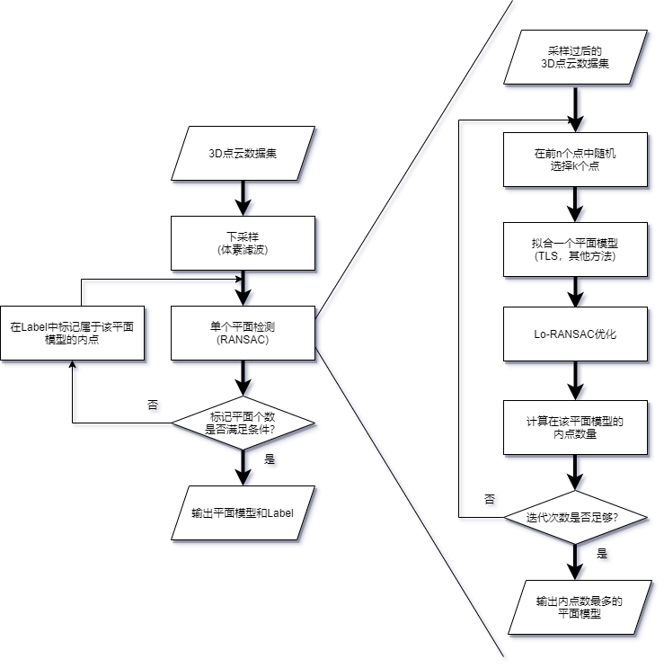

# 18-无面不测

### 介绍

团队名称：南方科技大学无面不测团队

团队成员：[钟万里](https://github.com/zoom1111)、[阮业淳](https://github.com/ryyyc)、[张昌圳](https://github.com/changzhenzhang)

指导导师：[于仕琪](https://github.com/ShiqiYu)

赛题导师：王步龙

本项目依托于 [OpenCV](https://github.com/opencv/opencv)，使用c++ 11为编程语言，实现了一种点云的多平面识别算法，同时进行了相对有效的算法优化，在多平面识别的准确度，识别速率上均有较为不错的表现。


<br><br>

### 技术背景分析

题目要求实现一种表面识别或重建的方法，识别多个面并处理一定的噪声和孤立点。我们团队计划实现 **点云空间中多个平面识别** 的算法。

点云数据是指在一个三维坐标系统中的一组向量的集合，以点的形式记录，每个点的信息包含三维坐标，有些可能含有颜色信息或反射强度信息。对于实现点云空间中识别多个平面的算法来说，我们仅需使用点云的三维坐标信息即可。我们认为，在OpenCV中使用行数为 N （数据点的总数），列数为 3 （三维坐标）的矩阵 [**cv::Mat**](https://docs.opencv.org/master/d3/d63/classcv_1_1Mat.html) 作为储存点云的数据结构，在多数据的矩阵运算上有着较大的速度优势，且点云数据在内存中是连续存储的，操作指针较为方便。

在经过多方面考量后，我们团队决定主要采用 RANSAC算法 实现点云空间中的多平面检测。为了解决RANSAC算法在大量点云数据中计算量高的问题，我们将对点云原始数据进行采样，降低用于计算距离的点的数据量，同时记录采样点和原始点之间的关系，尽可能地保留点云的空间特征。为了解决RANSAC算法无法同时检测多平面的问题，我们对已经识别出的平面进行标记，并多次应用RANSAC算法以达到要求。当找到一个平面时，标记这个平面的内点(到平面的距离小于给定的阈值的点)，找下一个平面时仅在未被标记的点中继续计算，当到达截止条件时（识别结果达到指定的平面个数或最后一次的平面结果的内点个数小于设定的值），算法终止。除此之外，我们也采用了多种的算法对RANSAC进行优化。

##### RANSAC算法

RANSAC的基本思想是通过从点云中随机选取3个点来选择多个平面模型，然后计算每个平面在阈值内的内点数量。最后，内点数最多点的平面就是当前点云中的最佳平面。

##### 体素滤波降采样

体素滤波降采样的基本原理是：将点云空间切割成大小相等的长方体或立方体，对于每一个立方体，选择距离该长方体内所有点的重心最近的点，代表整个长方体的点。

##### Lo-RANSAC

Lo-RANSAC有多种优化RANSAC的方案。在迭代计算找平面过程中，如果出现当前最优平面模型，则可以考虑进行 Lo-RANSAC。一种方法是从当前最优平面模型的内点中随机选取一些点来再次拟合平面模型并计算内点，迭代一定次数，并选择最佳的结果作为改进结果。

##### 剪枝

剪枝则是在计算平面模型的内点时，及时结束一些不必要的计算，属于细节上的优化。

##### 总体最小二乘法

在RANSAC中的平面模型拟合部分中，普通的最小二乘法(Ordinary Least Square)拟合平面时，可能会出现一些特殊的平面无法被拟合出来的情况，如平面 $x = 0$。而 总体最小二乘法(Total Least Square, TLS) 的计算方式可以解决这个问题。除此之外，也有其他的平面拟合方式，我们也准备通过测试来选择最终所采用的方法。

##### 迭代提前终止

我们使用概率论与统计学的理论，可以计算出迭代提前终止的条件，其原理是：

- 在一个点云空间 PC 中，点的数量是 $N$，最大的平面 PlaneMax 的内点的数量为 $M$，随机取三个点，这三个点都属于该平面 PlaneMax 的概率为$(\frac{M}{N})^3$
- 每次从点云空间中取三个点构造一个平面，连续构造$K$个平面都没有取到 PlaneMax 的概率是$(1 - (\frac{M}{N}) ^ 3) ^ K$，构造$K$个平面至少有一个平面是 PlaneMax 的概率是 $1 - (1 - (\frac{M}{N}) ^ 3) ^ K$
- 如果我们希望在概率不低于$P$的情况下正确地找到最大平面，那么我们就可以求解方程 $1 - (1 - (\frac{M}{N}) ^ 3) ^ K>P$,并得到结果$K > \frac{log(1-P)}{log (1 - (\frac{M}{N}) ^ 3)}$，所以我们只需要使迭代次数不小于$\frac{log(1-P)}{log (1 - (\frac{M}{N}) ^ 3)}$
- 还可以注意到的是，即使一开始不知道 $M$ 的大小，但是，在迭代过程中保存的到目前为止找到的最大平面的内点数量 $A$ 不会大于 $M$，所以算法所以只需要让迭代的次数不比 $\frac{log(1-P)}{log (1 - (\frac{A}{N}) ^ 3)}$ 小即可

##### 向量约束

在实际测试中，我们发现降采样会使得点云密度变得均匀，从而导致平面识别的顺序发生改变，虽然在多平面识别中并不影响，但是考虑实际应用中如：汽车识别路面，无人机识别墙面等应用中，需要仅对特定的平面识别。我们采用了向量约束的方式，仅识别法向量与该向量夹角不大的平面，即可检测特定方向的平面。

<br><br>

### 对实现题目的方案设计



<br><br>

### 软件环境

* OpenCV 4.5.1
* g++ 5.4
* Python 3.6 + Open3D Python 版 (可选，用于可视化)

安装教程: [OpenCV](https://docs.opencv.org/4.5.1/df/d65/tutorial_table_of_content_introduction.html), [Open3D](http://www.open3d.org/docs/latest/introduction.html)

<br><br>

### 目录结构

```
.
├── data (数据的输入和输出目录)
│   ├── Cassette_GT_.ply-sampling-0.2.ply
│   └── check.ply
│   └── check_label.txt
├── images (文档图片目录)
├── include (头文件目录)
│   ├── ransac.h
│   └── utils.h
├── source (源文件目录)
│   ├── main.cpp
│   ├── ransac.cpp
│   └── utils.cpp
└── viz  (可视化样例代码目录)
    └── Pointcloud-Visualization-With-Open3D.py
```

<br><br>

### 数据集

部分数据集来源于: [IQmulus & TerraMobilita Contest](http://data.ign.fr/benchmarks/UrbanAnalysis)，下载链接: [Zones 0-4](http://data.ign.fr/benchmarks/UrbanAnalysis/download/Z0-4.zip), [Cassette_idclass.zip](http://data.ign.fr/benchmarks/UrbanAnalysis/download/Cassette_idclass.zip).

另一部分数据集通过标准平面方程生成并添加噪声点

<br><br>

### 使用说明

3D点云平面检测的入口为

   ```c++
   /**
    * 
    * @param labels  点属于某个平面的标签, n × 1 矩阵, n 等于输入点云的大小 (输出)
    * @param planes  保存平面方程的vector, 方程表示为 ax + by + cz + d = 0 (输出)
    * @param points3d  输入的点云数据
    * @param thr  阈值
    * @param max_iterations 最大迭代次数
    * @param desired_num_planes  目标平面的数量
    * @param grid_size  降采样方格大小, 如果 小于等于 0，代表不进行降采样
    * @param normal 法向量约束，为 nullptr 代表不使用约束， 否则检测的平面法向量满足该约束
    */
   void get_planes(cv::Mat &labels, std::vector<cv::Vec4f> &planes, cv::InputArray &points3d,
                   float thr, int max_iterations, int desired_num_planes, float grid_size, cv::Vec3f *normal);
   ```

详细解释:

1.  **labels**: 参数类型为 `cv::Mat` ，n × 1 矩阵，单通道，int类型数据，用于保存点的标签，0 代表不属于任何平面， 正整数 k 代表属于编号 k 的平面
2.  **planes**: 参数类型为 `std::vector<cv::Vec4f>` ，用于保存平面的方程，[a, b, c, d] 四元组 对应  ax + by + cz + d = 0
3.  **points3d**: 参数类型为  `cv::Mat`，n × 3 矩阵，单通道，float类型数据，用于存储点云数据
4.  **thr**: 参数类型为 `float`，如果点到平面的距离小于该值，则认为这个点属于这个平面的内点
5.  **max_iterations**:  参数类型为 `int`，迭代次数达到该值则停止迭代，输出内点最多的平面方程
6.  **desired_num_planes**:  参数类型为 `int`，该值表示希望从点云中找出的平面的数量
7.  **grid_size**:  参数类型为 `float`，体素滤波降采样网格边长大小，如果小于等于0，代表不进行降采样处理
8.  **normal**: 参数类型为 `cv::Vec3f*`，三维空间中平面的法向量，为 nullptr 代表不使用约束， 否则检测的平面法向量满足该约束


<br><br>

### 运行DEMO

1. 克隆仓库
```shell
git clone https://gitee.com/openeuler2020/team-1902378398.git
```
2. 编译程序
```shell
cd team-1902378398

cmake .

make
```
Note: 上面为 Linux 操作系统的编译步骤，如果是 windows 操作系统，请先修改 [CMakeLists.txt](./CMakeLists.txt) 文件 第九行，将 OpenCV 目录设置为对应的安装目录。

3. 运行程序

* DEMO 1

```shell
./Point-Cloud-Plane-Detection 3 0.2 0.2 1000 ./data/check.ply 0 0 0
```

* DEMO 2
```shell
./Point-Cloud-Plane-Detection 3 0.5 0.22 1000 ./data/Cassette_GT_.ply-sampling-0.2.ply 0 0 0
```

传入参数分别是 目标平面数量、阈值、网格大小、最大迭代次数、点云文件路径、法向量约束（0、0、0 代表不使用法向量约束）

<br><br>


### 点云可视化

点云可视化可以通过 Open3D （APP版、C++版、Python版）、PCL（C++版、Python版）等方式实现

Python版 Open3D 可视化点云的样例代码在 [./viz/Pointcloud-Visualization-With-Open3D.py](./viz/Pointcloud-Visualization-With-Open3D.py)

- DEMO

```shell
python ./Pointcloud-Visualization-With-Open3D.py -cloud "../data/check.ply" -label "../data/check_label.txt"
```

<br><br>

### 测试

##### 基于 openeuler 的测试

测试平台配置:

- 架构: 鲲鹏920
- 操作系统: openEuler操作系统 release 2.0
- CPU: 8核8线程
- 内存大小: 8 GB

测试结果: 

| Dataset  | Point Cloud Size | Output Plane                                         | inliers num | Time Cost (s) |
| -------- | ---------------- | ---------------------------------------------------- | ----------- | ------------- |
| Z0       | 13653854         | 0.004945x + 0.011472y + 0.999922z + -291.109375 = 0  | 4727446     | 19.232788     |
| Z1       | 12128400         | 0.020881x + 0.012112y + 0.999708z + 254.261597 = 0   | 3813037     | 16.864428     |
| Z2       | 13685800         | 0.005071x + -0.012349y + 0.999911z + 289.661438 = 0  | 4823840     | 31.713732     |
| Z3       | 9783553          | 0.004871x + 0.001634y + 0.999987z + -11.740292 = 0   | 3481107     | 12.401383     |
| Z4       | 16693019         | 0.002529x + -0.013667y + -0.999903z + 322.821136 = 0 | 6809349     | 32.885815     |
| Cassette | 12000000         | 0.998165x + 0.057841y + 0.017908z + 3130946045 = 0   | 3307173     | 12.424324     |

<br>

##### 基于 Ubuntu 的测试

见 **[测试报告](./TEST_REPORT.pdf)(点击可下载测试报告详细内容)**，包含本程序测试及 PCL([Point Cloud Library](https://pointclouds.org/)) 的RANSAC测试

测试报告中的图片可以在 [./images/rep_pic](./images/rep_pic) 中找到，输出数据可以在分支 `opencv+open3d+pcl` 的 ` team-1902378398/data/labels` 路径下

<br>

单平面识别时间对比测试结果：


<br>

部分测试结果图如下：

- Z0


- Z1


- Cassette_GT


真实场景下的测试:


##### 测试结论

我们队伍的优化RANSAC算法有以下优点：

- 经过与PCL对比，以及与随机生成的标准平面方程测试，我们得到的平面方程几乎完全一致，验证了检测平面的准确性
- 在与PCL的速度对比中，总体上有较好的速度
- 能够一次识别多个平面
- 可以自由选择是否使用降采样预处理点云
- 可以识别特定方向的平面

对于体素滤波降采样，它加快了点云中检测平面的速度，在识别多个平面时提速更有效和直观，但是它还存在以下问题：

- 点云比较小并且只识别少量平面时，降采样耗时的比重很大削弱了其效果


<br><br>


### 参考文献

- R. Adams and L. Bischof. Seeded region growing. IEEE Transactions on Pattern Analysis and Machine Intelligence, 16(6):641-647, 19 94.
- Dorit Borrmann, Jan Elseberg, Kai Lingemann, and Andreas Nuchter. The 3d hough transform for plane detection in point clouds: A review and a new accumulator design. 3D Research, 0202, 06 2011.
- Onduřej Chum, Jiří Matas, and Josef Kittler. Locally optimized ransac. In Bernd Michaelis and Gerald Krell, editors, Pattern Recognition, pages 236-243, Berlin, Heidelberg, 2003. Springer Berlin Heidelberg.
- M. Fischler and R. Bolles. Random sample consensus: A paradigm for model fitting with applications to image analysis and automated cartography. Communications of the ACM, 24(6):381-395, 1981.

<br><br>

### 参与贡献

1.  Fork 本仓库
2.  新建 Feat_xxx 分支
3.  提交代码
4.  新建 Pull Request


### 南科大致仁活动室雷达实时演示视频
[在线播放链接](http://static.keykeeper.top/lidar-demo.mp4)

