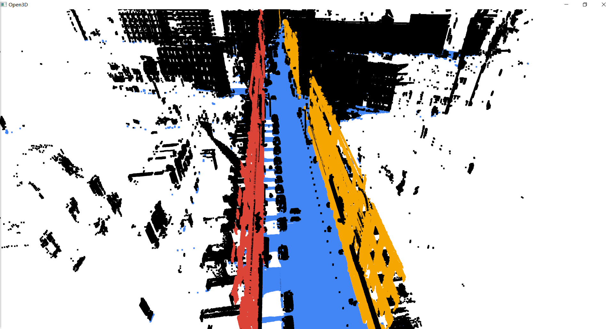

### Test overview and analysis

##### Test based on OpenEuler

Test platform configuration:

- Architecture: Kunpeng 920Test
- Operating system: OpenEuler operating system release 2.0
- CPU: 8 cores 8 threads
- Memory Size: 8 GB

Test Results:

| Dataset  | Point Cloud Size | Output Plane                                         | inliers num | Time Cost (s) |
| -------- | ---------------- | ---------------------------------------------------- | ----------- | ------------- |
| Z0       | 13653854         | 0.004945x + 0.011472y + 0.999922z + -291.109375 = 0  | 4727446     | 19.232788     |
| Z1       | 12128400         | 0.020881x + 0.012112y + 0.999708z + 254.261597 = 0   | 3813037     | 16.864428     |
| Z2       | 13685800         | 0.005071x + -0.012349y + 0.999911z + 289.661438 = 0  | 4823840     | 31.713732     |
| Z3       | 9783553          | 0.004871x + 0.001634y + 0.999987z + -11.740292 = 0   | 3481107     | 12.401383     |
| Z4       | 16693019         | 0.002529x + -0.013667y + -0.999903z + 322.821136 = 0 | 6809349     | 32.885815     |
| Cassette | 12000000         | 0.998165x + 0.057841y + 0.017908z + 3130946045 = 0   | 3307173     | 12.424324     |

 

##### Ubuntu Based Test

See **[Test Report](./TEST_REPORT.pdf) (click to download the details of the test report)**, including the test of this program and PCL([Point Cloud Library](https://pointclouds.org/)) RANSAC test

The pictures in the test report can be found in [./images/rep_pic](./images/rep_pic).

 

Single plane recognition time comparison test results:

 

Some test results are as follows:

- Z0

- Z1

- Cassette_GT

Tests in real scenarios:

##### Test conclusion

Our team’s optimized RANSAC algorithm has the following advantages:

- After comparing with PCL and testing with randomly generated standard plane equations, the plane equations we got are almost identical, verifying the accuracy of the detection plane
- In the speed comparison with PCL, the overall speed is better
- Able to identify multiple planes at once
- You can freely choose whether to use sampling to preprocess the point cloud
- Can identify planes in specific directions

For voxel filtering and sampling, it speeds up the detection of planes in the point cloud, which is more effective and intuitive when identifying multiple planes, but it also has the following problems:

- When the point cloud is relatively small and only a few planes are recognized, the time-consuming proportion of sampling is very large, which weakens its effect